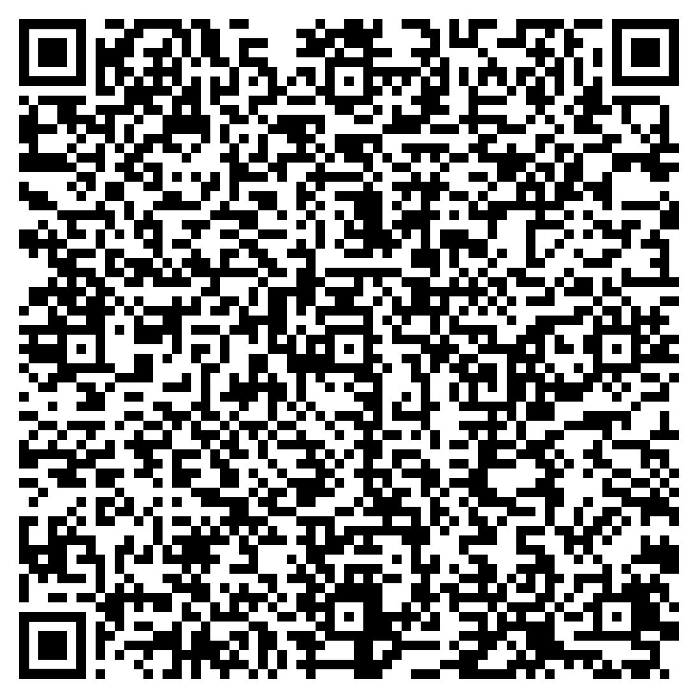

# Barrierefreie Bürgerkommunikation: QR-Code Verschlüsselungsdemo

Für unser Projekt mit dem Zoll haben wir einen digitalen Prototypen designed. Dieser soll über einen QR-Code auf einem Brief erreichbar sein. Um den Bürger:innen unsere Leistungen anzubieten, brauchen wir personenbezogene Daten. Dabei wollen wir möglichst Datensparsam sein, also keine Nutzerdatenbank anlegen und verwalten. Wir wollen die Daten dort abgreifen, wo sie sowieso schon vorliegen, nämlich auf dem Brief.

Wir legen also in dem QR-Code personenbezogene Daten ab. Damit diese von QR-Lesern vor der Weiterleitung in den Browser nicht ausgelesen werden können, verschlüsseln wir die Daten vorher. Der Nutzer muss dann bei Gebrauch der App seine Daten erst wieder entschlüsseln. Dazu verwendet er die Steuernummer, die er oben rechts auf dem Brief vom Zoll vorfindet.

Diese kleine Anwendung dient nur der Demonstration, des Ver- und Entschlüsselungsprozesses.

## Demo

Eine Demonstration mit einigen Daten findet sich unter: `https://zoll-assistent.netlify.app/#RelcCndCvtfeJ/ATCuvaHKORwn5tkhq4o6Du58DqG9K7LanAG+HsvBQfrwaOBHFO/fNZvkGtONLnrjlxnwnGgLds7tjudvW1e69XMTO92gvTUKg6k5CZZiAJq1nyY0trdm0SuRewVUEFaPV6I2vUZ5IxmgWoQe9CujBQQ820NZIV35VLzSdG41jsZ760G2F9fPh8oo/PP7rw0tOB8tIF6moWkDVqQaAqcfKW5MC3NcXbKfr2KnY0KQInpAtxdURPuCzkT9QZm5RZTts5NkM=`

bzw. in einem QR-Code encodiert:



## Daten verschlüsseln

Verschlüsselt wird ein JSON Objekt. Für diesen Fall:

```json
{
  "firstName": "Max",
  "lastName": "Mustermann",
  "taxNumber": "K12345678900",
  "flavour": "Alle Daten in der URL wurden sicher entschlüsselt! Sie liegen jetzt in deiner Session Storage."
}
```

Diese Daten werden in einen String encodiert. Und dann `AES-GCM` verschlüsselt. Die URL, setzt sich dann folgendermaßen zusammen:

`assistent.zoll.de/#` + `RelcCndCvtfeJ/ATCuvaHKORwn5tkhq4o6Du58DqG9K7LanAG+HsvBQfrwaOBHFO/fNZvkGtONLnrjlxnwnGgLds7tjudvW1e69XMTO92gvTUKg6k5CZZiAJq1nyY0trdm0SuRewVUEFaPV6I2vUZ5IxmgWoQe9CujBQQ820NZIV35VLzSdG41jsZ760G2F9fPh8oo/PP7rw0tOB8tIF6moWkDVqQaAqcfKW5MC3NcXbKfr2KnY0KQInpAtxdURPuCzkT9QZm5RZTts5NkM=`

Dabei verwenden wir ein `#` (HTML-Fragment), damit die Daten nicht gleich an den Server übertragen werden.

Die Verschlüsselung der Daten kann über das Script in `/scripts/encrypt.js` ausgeführt werden. Dazu kann man einfach die zu veschlüsselnde JSON anpassen und dass Programm dann mit `node encrypt.js` ausführen. 

## Daten entschlüsseln

Die Nutzer:in wird beim Aufruf der App dann dazu aufgefordert die Steuernummer einzugeben. Damit werden die Daten wieder entschlüsselt.

## This Project uses Create React App

This project was bootstrapped with [Create React App](https://github.com/facebook/create-react-app).

### Available Scripts

In the project directory, you can run:

#### `yarn start`

Runs the app in the development mode.\
Open [http://localhost:3000](http://localhost:3000) to view it in the browser.

The page will reload if you make edits.\
You will also see any lint errors in the console.

#### `yarn build`

Builds the app for production to the `build` folder.\
It correctly bundles React in production mode and optimizes the build for the best performance.

The build is minified and the filenames include the hashes.\
Your app is ready to be deployed!

See the section about [deployment](https://facebook.github.io/create-react-app/docs/deployment) for more information.

### Learn More

You can learn more in the [Create React App documentation](https://facebook.github.io/create-react-app/docs/getting-started).

To learn React, check out the [React documentation](https://reactjs.org/).
